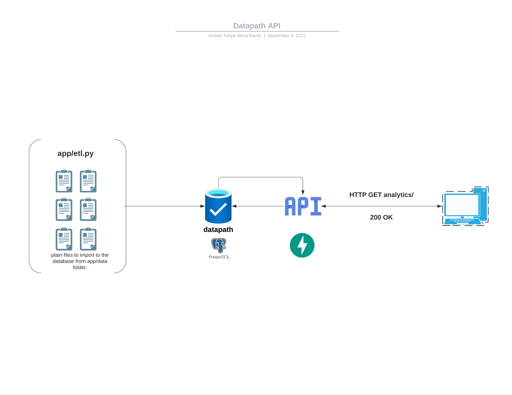

# Data Engineering with Python

This project will show you a basic ETL process where we are going to create a PostgreSQL database for a company using Python (and the files in the `app/data` folder) and then make an API using FastAPI where we can get some insights from that data such as
Income by department
top products
top categories



# How to replicate this project?

1. Clone this repo with `git clone`.
2. Create a virtual environment and activate it (I use `venv`: check [here](https://docs.python.org/3/library/venv.html) how to do it)
3. Install the requirements in `requirements.txt` with `pip install -r requirements.txt`.
4. Create a `.env` file in your root directory and fill in the environment variables that you'll need to connect to your database and the API URL (hint: follow the naming of `.env.sample`)
5. Run the following command in your terminal: `uvicorn app.main:app --reload`.

## Notes

- You can import the postman collection to make the API testing and usage easier.
- Remember that using FastApi, you can check the API docs in `http://localhost:8000/docs` or `http://localhost:8000/redoc` (assuming your host is your localhost).

## Others

The following is the structure of my folder, in case you wonder how I structured it.

```
├── .env
├── .env.sample
├── README.md
├── app
│   ├── __pycache__
│   ├── data
│   │   ├── categories
│   │   ├── customers
│   │   ├── departments
│   │   ├── order_items
│   │   ├── orders
│   │   └── products
│   ├── database.py
│   ├── etl.py
│   ├── main.py
│   ├── queries
│   │   ├── income_by_dep.sql
│   │   ├── top_categories.sql
│   │   ├── top_clients.sql
│   │   ├── top_fraud.sql
│   │   └── top_products.sql
│   ├── schemas.py
│   └── utils
│       ├── __init__.py
│       ├── __pycache__
│       ├── column_details.py
│       ├── config.py
│       └── logger.py
├── consume_api.ipynb
├── postman_collection.json
└── requirements.txt
```

And the following is the result of executing `\d+` in the database once is populated.

```
                                        List of relations
 Schema |    Name     | Type  |  Owner   | Persistence | Access method |    Size    | Description
--------+-------------+-------+----------+-------------+---------------+------------+-------------
 public | categories  | table | postgres | permanent   | heap          | 8192 bytes |
 public | customers   | table | postgres | permanent   | heap          | 1344 kB    |
 public | departments | table | postgres | permanent   | heap          | 8192 bytes |
 public | order_items | table | postgres | permanent   | heap          | 10176 kB   |
 public | orders      | table | postgres | permanent   | heap          | 4232 kB    |
 public | products    | table | postgres | permanent   | heap          | 256 kB     |
```

Please, feel free to do a PR if you find something to improve (I'm sure there is a lot).
